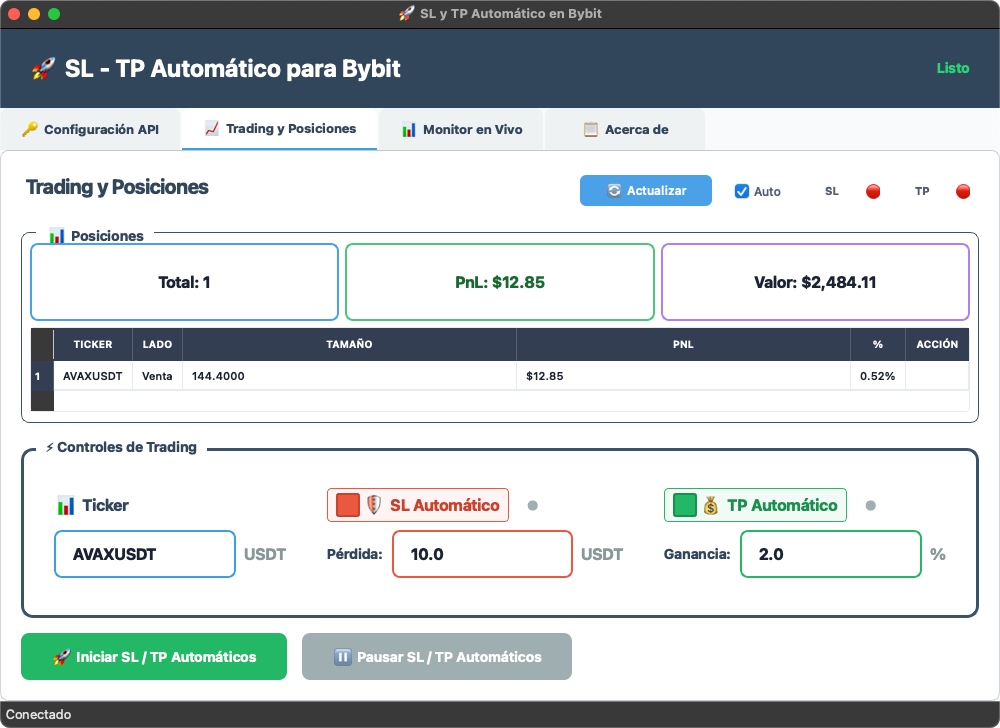

# 🚀 SL y TP Automático para Bybit

<div align="center">

[](https://github.com/codavidgarcia/sl-tp-automatico-bybit/stargazers)
[](https://github.com/codavidgarcia/sl-tp-automatico-bybit/network)
[](https://t.me/codavidgarcia)

[](https://github.com/codavidgarcia/sl-tp-automatico-bybit)

</div>

Aplicación de trading automatizada con interfaz gráfica moderna para gestionar Stop Loss (SL) y Take Profit (TP) automáticos en Bybit.

## 📋 Descripción

Esta aplicación permite automatizar la gestión de Stop Loss y Take Profit en tus posiciones de Bybit mediante una interfaz gráfica desarrollada con PySide6. Se conecta directamente a la API de Bybit para monitorear y gestionar posiciones en tiempo real, incluso modificando en medio del trade, además utiliza órdenes Limit para TP, mejorando la rentabilidad de los trades.




## ✨ Características Principales

- **Interfaz Gráfica**: Diseño con PySide6 y feedback visual inmediato
- **Gestión Exclusiva de SL/TP**: Control total de órdenes con cancelación automática de conflictos
- **Modo Cobertura**: Sistema de autodetección y funcionamiento correcto incluso en modo cobertura
- **Actualizaciones en Tiempo Real**: Modificación instantánea de SL/TP incluso en medio de un trade
- **Monitor en Tiempo Real**: Visualización en vivo de posiciones y PnL
- **Conexión Segura**: Credenciales encriptadas y almacenadas localmente
- **Auto-selección**: Selección automática de ticker cuando solo hay una posición y detección de tickers en tiempo real para selección sin necesidad de escribirlo manualmente
- **Comisiones Optimizadas**: Uso de órdenes Limit (0.020% maker) vs Trading Stops (0.055% taker)

## 🚀 Descarga Rápida

### 📦 Ejecutables (No requiere Python)
Descarga directa para usar inmediatamente:

- **🪟 Windows**: [SL-TP-Automatico-Windows-v1.1.0.zip](dist/SL-TP-Automatico-Windows-v1.1.0.zip) *(~43MB)*
- **🍎 macOS**: [SL-TP-Automatico-macOS-v1.1.0.zip](dist/SL-TP-Automatico-macOS-v1.1.0.zip) *(~43MB)*
- **🐧 Linux**: [SL-TP-Automatico-Linux-v1.1.0.tar.gz](dist/SL-TP-Automatico-Linux-v1.1.0.tar.gz) *(~42MB)*

### 🎯 Instrucciones de Instalación Rápida

#### 🪟 **Windows**
1. Descarga `SL-TP-Automatico-Windows-v1.1.0.zip`
2. Extrae el archivo `SL-TP-Automatico.exe`
3. Ejecuta directamente (doble clic)
4. Si aparece SmartScreen: "Más información" → "Ejecutar de todos modos"

#### 🍎 **macOS**
1. Descarga `SL-TP-Automatico-macOS-v1.1.0.zip`
2. Extrae `SL-TP-Automatico.app`
3. Ejecuta directamente (doble clic)
4. Si aparece advertencia: Sistema → Seguridad → "Abrir de todos modos"

#### 🐧 **Linux**
```bash
# Descargar y extraer
tar -xzf SL-TP-Automatico-Linux-v1.1.0.tar.gz

# Dar permisos de ejecución
chmod +x SL-TP-Automatico

# Ejecutar
./SL-TP-Automatico
```

## 🛠️ Requisitos del Sistema

### Requisitos Mínimos
- **Sistema Operativo**: Windows 10/11, macOS 10.14+, o Linux Ubuntu 18.04+
- **Python**: Versión 3.8 o superior
- **RAM**: Mínimo 4GB
- **Conexión a Internet**: Requerida para conectar con la API de Bybit

### Dependencias de Python
```
PySide6>=6.0.0
pybit>=5.0.0
requests>=2.25.0
```

## 📦 Instalación y Distribución

### Método 1: Ejecutables Precompilados (Más Fácil)

Si solo quieres usar la aplicación sin instalar Python:

#### Windows
1. Descarga `SL-TP-Automatico-Windows-v1.1.0.zip`
2. Extrae y ejecuta `SL-TP-Automatico.exe`
3. ¡Listo! No necesitas Python ni dependencias

#### macOS
1. Descarga `SL-TP-Automatico-macOS-v1.1.0.zip`
2. Extrae y ejecuta `SL-TP-Automatico.app`
3. ¡Listo! No necesitas Python ni dependencias

### Método 2: Crear Tu Propio Ejecutable

Si quieres compilar la aplicación tú mismo:

#### Constructor Universal (Recomendado)
```bash
# Funciona en Windows, Mac y Linux
python build.py
```

#### Constructores Específicos por Plataforma

**Windows:**
```cmd
build_windows.bat
```

**macOS:**
```bash
./build_mac.sh
```

### Método 3: Instalación Automática (Para Desarrolladores)

#### Windows
1. Descarga o clona el repositorio
2. Ejecuta el instalador automático:
```cmd
install_windows.bat
```

#### macOS/Linux
1. Descarga o clona el repositorio
2. Ejecuta el instalador automático:
```bash
chmod +x install_unix.sh
./install_unix.sh
```

### Método 2: Instalación Manual

#### Paso 1: Verificar Python
Asegúrate de tener Python 3.8+ instalado:
```bash
python --version
```

Si no tienes Python instalado, descárgalo desde [python.org](https://python.org)

#### Paso 2: Clonar el Repositorio
```bash
git clone https://github.com/codavidgarcia/sl-tp-automatico-bybit.git
cd sl-tp-automatico-bybit
```

#### Paso 3: Instalar Dependencias
```bash
# Opción 1: Usando requirements.txt (recomendado)
pip install -r requirements.txt

# Opción 2: Instalación manual
pip install PySide6 pybit requests
```

#### Paso 4: Crear Entorno Virtual (Opcional pero Recomendado)
```bash
# Crear entorno virtual
python -m venv venv

# Activar entorno virtual
# En Windows:
venv\Scripts\activate
# En macOS/Linux:
source venv/bin/activate

# Instalar dependencias en el entorno virtual
pip install -r requirements.txt
```

## 🚀 Cómo Ejecutar la Aplicación

### Método 1: Script de Ejecución (Recomendado)
```bash
python run.py
```
Este script verifica automáticamente las dependencias antes de ejecutar la aplicación.

### Método 2: Ejecución Directa
```bash
python pyside_trading_gui.py
```

### Método 3: Desde el Directorio
```bash
cd sl-tp-automatico-bybit
python pyside_trading_gui.py
```

### Con Entorno Virtual
Si creaste un entorno virtual, primero actívalo:
```bash
# Windows
venv\Scripts\activate

# macOS/Linux
source venv/bin/activate

# Luego ejecuta la aplicación
python run.py
```

## ⚙️ Configuración Inicial

### 1. Obtener Credenciales de API de Bybit

1. **Crear Cuenta en Bybit**: Si no tienes una, regístrate en [bybit.com](https://www.bybit.com/invite?ref=PX75E3N) (Contiene link de referido) 

2. **Acceder a Gestión de API**:
   - Inicia sesión en tu cuenta de Bybit
   - Ve a "Gestión de API" en tu perfil
   - Haz clic en "Crear clave API"

3. **Configurar Permisos**:
   - ✅ **Trading de Futuros**: OBLIGATORIO
   - ✅ **Lectura de Posiciones**: OBLIGATORIO
   - ❌ **Retiro**: NO recomendado por seguridad

4. **Guardar Credenciales**:
   - Copia tu **Clave API**
   - Copia tu **Secreto API**
   - ⚠️ **IMPORTANTE**: Nunca compartas estas credenciales

### 2. Configurar la Aplicación

1. **Ejecutar la Aplicación**:
   ```bash
   python pyside_trading_gui.py
   ```

2. **Ir a la Pestaña "🔑 Configuración API"**

3. **Ingresar Credenciales**:
   - Pega tu **Clave API** en el primer campo
   - Pega tu **Secreto API** en el segundo campo
   - Usa los botones 👁️ para mostrar/ocultar las credenciales

4. **Guardar y Probar**:
   - Haz clic en "💾 Guardar Credenciales"
   - Haz clic en "🔍 Probar Conexión"
   - Verifica que aparezca "¡Conexión exitosa!"

## 📈 Uso de la Aplicación

### Pestaña 1: 🔑 Configuración API
- Configurar credenciales de Bybit
- Probar conexión con la API
- Ver estado de conexión

### Pestaña 2: 📈 Trading y Posiciones
- **Ver Posiciones Actuales**: Resumen de posiciones activas
- **Configurar Trading**:
  - **Ticker**: Símbolo de la criptomoneda (ej: BTC, ETH)
  - **SL Automático**: Activar/configurar Stop Loss en USDT
  - **TP Automático**: Activar/configurar Take Profit en porcentaje
- **Controles**:
  - "🚀 Iniciar SL / TP Automáticos": Comenzar automatización
  - "⏸️ Pausar SL / TP Automáticos": Detener automatización

### Pestaña 3: 📊 Monitor en Vivo
- Registro de actividad en tiempo real
- Logs de operaciones y errores
- Botón para limpiar historial

### Pestaña 4: ℹ️ Acerca de
- Información sobre la aplicación
- Créditos y enlaces de contacto

## 🏗️ Construcción de Ejecutables

### Proceso de Construcción

#### Método Universal (Recomendado)
```bash
# 1. Instalar dependencias de construcción
pip install -r requirements.txt

# 2. Ejecutar constructor universal
python build.py
```

#### Proceso Manual con PyInstaller
```bash
# Windows
pyinstaller --onefile --windowed --name "SL-TP-Automatico" pyside_trading_gui.py

# macOS
pyinstaller --onefile --windowed --name "SL-TP-Automatico" --osx-bundle-identifier "com.codavidgarcia.sl-tp-automatico" pyside_trading_gui.py
```

### Resultados de la Construcción

#### Windows
- **Archivo**: `dist/SL-TP-Automatico.exe`
- **Tamaño**: ~80-120 MB
- **Distribución**: Envía solo el archivo .exe

#### macOS
- **Archivo**: `dist/SL-TP-Automatico` (aplicación Unix)
- **DMG**: `dist/SL-TP-Automatico.dmg` (opcional)
- **Tamaño**: ~80-120 MB
- **Distribución**: Envía la aplicación o el DMG

### Optimización del Ejecutable

Para reducir el tamaño del ejecutable:
```bash
# Usar UPX (compresor de ejecutables)
pip install upx-ucl
pyinstaller --onefile --windowed --upx-dir=/path/to/upx pyside_trading_gui.py
```

## 🔧 Configuración Avanzada

### Personalizar Intervalos de Actualización
La aplicación actualiza las posiciones cada 5 segundos por defecto. Para cambiar esto, modifica la línea en el código:
```python
self.positions_refresh_timer.start(5000)  # 5000ms = 5 segundos
```

### Configurar Diferentes Símbolos
La aplicación soporta cualquier símbolo disponible en Bybit:
- BTC, ETH, ADA, DOT, LINK, etc.
- Formato: Solo el símbolo base (ej: "BTC" no "BTCUSDT")

## ⚠️ Advertencias Importantes por Plataforma

### 🪟 **Windows**
- **SmartScreen**: Windows puede mostrar "Aplicación no reconocida"
  - **Solución**: Clic en "Más información" → "Ejecutar de todos modos"
- **Antivirus**: Puede dar falsos positivos (común con PyInstaller)
  - **Solución**: Agregar excepción en tu antivirus
- **Firewall**: Puede pedir permisos de red
  - **Solución**: Permitir acceso para conectar con Bybit

### 🍎 **macOS**
- **Gatekeeper**: "No se puede abrir porque proviene de un desarrollador no identificado"
  - **Solución**: Sistema → Seguridad → "Abrir de todos modos"
- **Permisos**: Puede pedir permisos de red
  - **Solución**: Permitir en las preferencias del sistema

### 🐧 **Linux**
- **Permisos**: El archivo puede no tener permisos de ejecución
  - **Solución**: `chmod +x SL-TP-Automatico`
- **Dependencias**: Algunas distribuciones pueden necesitar librerías adicionales
  - **Solución**: `sudo apt-get install libxcb-xinerama0` (Ubuntu/Debian)

## 🛡️ Seguridad

### Almacenamiento de Credenciales
- Las credenciales se guardan en `config.json` en tu computadora
- **NO se envían a servidores externos**
- Conexión directa y segura con la API de Bybit
- Archivo encriptado localmente

### Recomendaciones de Seguridad
1. **Nunca compartas** tu archivo `config.json`
2. **Usa permisos mínimos** en tu API de Bybit
3. **No habilites retiros** en tu clave API
4. **Mantén actualizada** la aplicación

## 🐛 Solución de Problemas

### Error: "Could not import trading modules"
**Causa**: Faltan dependencias o módulos auxiliares
**Solución**:
```bash
pip install --upgrade PySide6 pybit requests
```

### Error: "Conexión fallida"
**Causa**: Credenciales incorrectas o problemas de red
**Solución**:
1. Verificar credenciales en Bybit
2. Comprobar conexión a internet
3. Verificar que la API esté activa


### La Aplicación No Inicia
**Solución**:
```bash
# Verificar Python
python --version

# Reinstalar dependencias
pip uninstall PySide6 pybit requests
pip install PySide6 pybit requests

# Ejecutar con verbose
python -v pyside_trading_gui.py
```

## 📞 Soporte y Contacto

### Desarrollo
- **Juan David Garcia** (@codavidgarcia)
- **Telegram**: [@codavidgarcia](https://t.me/codavidgarcia)
- **GitHub**: [Perfil de GitHub](https://github.com/codavidgarcia)

### Herramientas Originales
- **Andrés Perea** (El gafas trading) - Scripts de SL automático y TP automático disponibles en https://github.com/ElGafasTrading

### Donaciones
Si esta aplicación te ha sido útil, puedes apoyar el desarrollo:
- **USDT (TRC20)**: `TApSFrenRkfbYtGKFb6478eEZPxtZkfody`
- **PayPal**: [http://paypal.me/cojuangarcia](http://paypal.me/cojuangarcia)
- **GitHub**: Dale una ⭐ al repositorio

## 📄 Licencia

Este proyecto está bajo la Licencia MIT. Ver el archivo `LICENSE` para más detalles.

## 🔄 Actualizaciones

### Versión Actual: 1.0.0
- Interfaz gráfica completa con PySide6
- Gestión automática de SL/TP
- Monitor en tiempo real
- Configuración segura de API

### Próximas Características
- TBD
## 🙏 Apoya el Proyecto

<div align="center">

### ⭐ ¡Dale una Estrella!
Si esta aplicación te ha sido útil, **dale una estrella** para apoyar el desarrollo:

[](https://github.com/codavidgarcia/sl-tp-automatico-bybit)

### 💰 Donaciones
Tu apoyo ayuda a mantener y mejorar esta herramienta:

[-green?style=for-the-badge)](https://github.com/codavidgarcia/sl-tp-automatico-bybit#-donaciones)
[](http://paypal.me/cojuangarcia)

### 📢 Comparte
Ayuda a otros traders compartiendo este proyecto:

[](https://t.me/share/url?url=https://github.com/codavidgarcia/sl-tp-automatico-bybit&text=🚀%20Increíble%20aplicación%20de%20trading%20automático%20para%20Bybit!)
[](https://twitter.com/intent/tweet?text=🚀%20Increíble%20aplicación%20de%20trading%20automático%20para%20Bybit!&url=https://github.com/codavidgarcia/sl-tp-automatico-bybit)

</div>

---

**⚠️ Disclaimer**: Esta aplicación es para fines educativos y de automatización personal. El trading de criptomonedas conlleva riesgos. Usa bajo tu propia responsabilidad!
